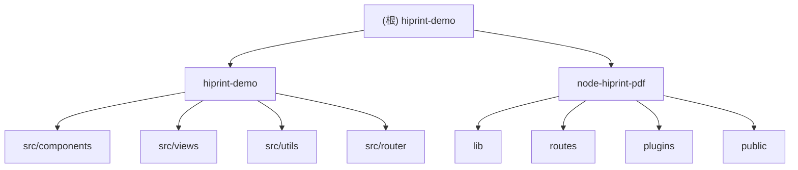

# hiprint-demo

> 基于 node-hiprint 的 PDF/图片生成服务，使用 Fastify + Puppeteer + Docker

## 项目愿景

提供完整的物流面单打印解决方案，包含：
- **前端**：Vue 3 可视化模板设计器，支持拖拽设计、实时预览、模板管理
- **后端**：Node.js PDF/图片生成服务，基于 Puppeteer 无头浏览器渲染

## 架构总览

```
hiprint-demo/
|-- hiprint-demo/        # Vue 3 前端 - 模板设计器
|   |-- src/
|   |   |-- components/  # 核心组件（设计器、模板管理等）
|   |   |-- views/       # 页面视图
|   |   |-- utils/       # 工具函数与数据模型
|   |   |-- router/      # 路由配置
|   |   +-- main.js      # 应用入口
|   +-- vite.config.js   # Vite 构建配置
|
+-- node-hiprint-pdf/    # Node.js 后端 - PDF 生成服务
    |-- lib/             # 核心库（Puppeteer 封装）
    |-- routes/          # API 路由
    |-- plugins/         # Fastify 插件
    |-- public/          # 静态资源与渲染模板
    |-- Dockerfile       # Docker 构建
    +-- app.js           # 应用入口
```

## 模块结构图



## 模块索引

| 模块路径 | 语言/框架 | 职责 | 入口文件 | 文档 |
|----------|-----------|------|----------|------|
| `hiprint-demo/` | Vue 3 + Vite | 前端模板设计器 | `src/main.js` | [CLAUDE.md](./hiprint-demo/CLAUDE.md) |
| `node-hiprint-pdf/` | Node.js + Fastify | PDF/图片生成后端服务 | `app.js` | [CLAUDE.md](./node-hiprint-pdf/CLAUDE.md) |

## 运行与开发

### 环境要求

- Node.js >= 18.x
- npm >= 8.x 或 pnpm >= 7.x
- Docker（可选，用于后端部署）

### 前端开发

```bash
cd hiprint-demo
npm install
npm run dev          # 启动开发服务器 (http://localhost:3000)
npm run build        # 构建生产版本
npm run preview      # 预览生产构建
```

### 后端开发

```bash
cd node-hiprint-pdf
npm install
npm run dev          # 开发模式启动
npm run start        # 生产模式启动 (http://localhost:3000)
```

### Docker 部署（后端）

```bash
cd node-hiprint-pdf
docker compose up -d
```

### 环境变量

| 变量名 | 用途 | 默认值 |
|--------|------|--------|
| `VITE_HIPRINT_SERVICE_URL` | 前端连接后端服务地址 | `http://localhost:3000` |
| `PUPPETEER_EXECUTABLE_PATH` | Puppeteer Chromium 路径 | `/usr/bin/chromium-browser` |

## 测试策略

> **注意**：当前项目尚未配置自动化测试框架。

### 手动测试要点

1. **前端设计器**：拖拽组件、预览打印、模板保存/加载
2. **后端 API**：POST `/pdf`、`/img`、`/html` 接口验证
3. **端到端**：前端调用后端生成 PDF/图片完整流程

### 建议补充

- 前端：Vitest + Vue Test Utils
- 后端：Fastify 内置测试 + Jest
- E2E：Playwright / Cypress

## 编码规范

### 前端（Vue 3）

- 使用 Composition API + `<script setup>`
- 组件命名：PascalCase（如 `LogisticsDesigner.vue`）
- 变量/函数：camelCase（如 `handlePreview`）
- CSS 类名：kebab-case（如 `action-bar`）
- 使用 Element Plus 消息组件反馈操作结果
- SCSS 嵌套不超过 3 层

### 后端（Node.js）

- 使用 ES Modules (`import/export`)
- 异步操作使用 `async/await`
- 错误处理返回统一格式：`{ code, msg, data }`

### 详细规范

参见 [AGENTS.md](./AGENTS.md)

## AI 使用指引

### 常见任务

1. **添加新打印元素类型**
   - 前端：修改 `hiprint-demo/src/components/DraggableModules.vue`
   - 参考 `defaultTemplate.js` 中的元素定义格式

2. **修改 PDF 生成参数**
   - 后端：修改 `node-hiprint-pdf/routes/root.js` 中的 options
   - 参考 Puppeteer PDF 选项文档

3. **添加新 API 端点**
   - 后端：在 `node-hiprint-pdf/routes/` 下添加新路由文件
   - Fastify 自动加载 routes 目录

4. **自定义物流数据字段**
   - 前端：修改 `hiprint-demo/src/utils/logisticsData.js`
   - 更新 `LogisticsDesigner.vue` 中的数据编辑表单

### 关键文件速查

| 功能 | 文件路径 |
|------|----------|
| 设计器核心逻辑 | `hiprint-demo/src/components/LogisticsDesigner.vue` |
| 默认模板定义 | `hiprint-demo/src/utils/defaultTemplate.js` |
| 数据模型 | `hiprint-demo/src/utils/logisticsData.js` |
| 后端 API 调用 | `hiprint-demo/src/utils/hiprintService.js` |
| Puppeteer 封装 | `node-hiprint-pdf/lib/puppeteer-html-export.js` |
| API 路由 | `node-hiprint-pdf/routes/root.js` |
| Docker 配置 | `node-hiprint-pdf/Dockerfile` |

## 变更记录 (Changelog)

| 时间 | 版本 | 变更内容 |
|------|------|----------|
| 2026-02-04 | 初始化 | 初始化项目文档结构 |
